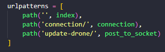
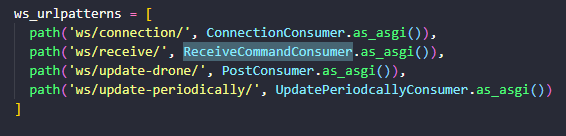
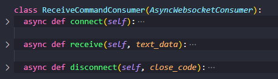

## README para auxiliar ambiente de desenvolvimento

#### Pré-requisitos
<!--ts-->
  * Ter python3 instalado na máquina
<!--te-->

#### Clonando o repositório:
<!--ts-->
  * Clonar repositório do github para máquina local
  * Criar virtual env (passos no Windows (prompt) abaixo)
    * python -m venv C:\path-até-root-desse projeto/venv
    * Mais info em "https://docs.python.org/3/library/venv.html"
  * Ativar venv
    * C:\path-até-root-desse-projeto\venv\Scripts\activate
  * Instalar bibliotecas do projeto dentro do venv
    * Na pasta root do projeto, rodar "pip install -r requirements.txt"
<!--te-->

#### Acessando variaveis secretas:
<!--ts-->
  * Criar file com nome .env na pasta "config" em root/config
  * Colocar as variáveis secretas dentro do arquivo .env:
    * Digitar a chave: SECRET_KEY='xxxx'
    * Digitar a chave: GOOGLE_MAPS_API_KEY='xxxx'
<!--te-->

#### Modificar informações conexão serial
<!--ts-->
  * Modificar os campos no arquivo serial_config.ini
    * port -> porta que o esp está conectado
    * baudrate -> bit rate da conexão serial
<!--te-->

#### Rodando servidor conexão arduino:
<!--ts-->
  * Rodar python manage.py runserver
<!--te-->

#### Acessando página home:
<!--ts-->
  * Acessar localhost:8000
<!--te-->

 

## Dinâmica url/view e routing/consumers

#### URL/View

Dentro do Django, a dinâmica de rotas é dada pela relação url/view. Uma view é uma função, disparada quando uma url correspondente é acessada.

Com a url pattern acima, ao acessar, dentro do ambiente de desenvolvimento, a url http://localhost:8000/update-drone/, o callback do método post_to_socket (view) é disparado. É passado um http request para a view, que por sua ver precisa retornar uma response.

Nesse projeto, é utilizada a rota mencionada acima para receber <b>requests POST</b>, com informações de devices. Queremos exibir tais informações em tela, e precisamos enviar do back-end (Django), para o front-end (HTML/Javascript). Essa conexão entre Django e Javascript é feita via <b>websocket</b>, com auxílio da biblioteca django-channels. O django-channels utiliza uma dinâmica parecida com a dinâmica url/view mencionada acima.

#### Routing/Consumer

De forma similar com as requisições de determinada url para uma view, é possível definir uma rota para realizar uma conexão websocket com o django. Essa conexão dedicada é full-duplex, sendo acessada por uma <b>route</b>, disparando um método ou classe, chamada <b>consumer</b>.

Acima estão representadas as rotas websocket e uma classe Consumer, que estende a classe genérica AsyncWebsocketConsumer, substituindo os métodos para lidar com conexão, desconexão e quando recebe mensagem. Logo, no Javascript, é possível abrir uma conexão, por exemplo, acessando ws://localhost:8000/ws/update-drone/, chamando o método connect do respectivo Consumer, o método disconnect, ao perder a conexão e o método receive, ao enviar alguma mensagem.

#### Visão geral para requsições POST

Com essas informações, será traçado o caminho de uma mensagem recebida via POST, dentro do Django, até chegar no front-end. 

É possível enviar uma requisição POST para o Django, acessando a rota (em desenvolvimento) http://localhost:8000/update-drone/. Essa url tem uma view respectiva, que receberá o conteúdo enviado via POST e irá repassar para um Consumer, caso tenha uma conexão websocket ativa. Esse Consumer receberá a mensagem e, por fim, enviará via websocket para o Javascript. 

